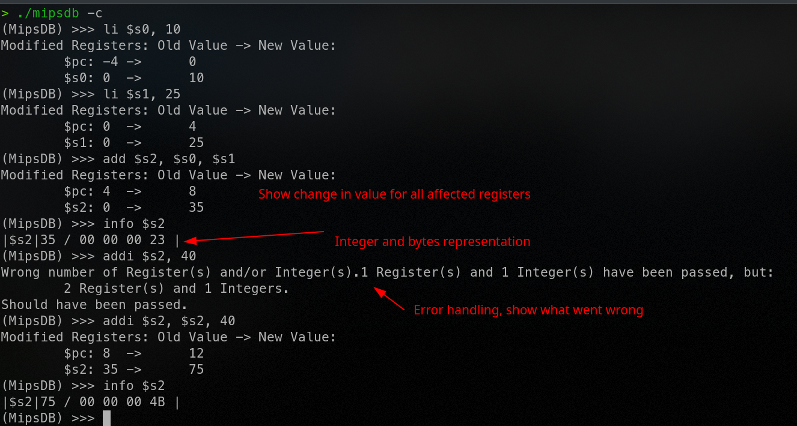

# MIPS Interactive Debugger

Project made for USP - São Carlos: SSC0902 - Organização e Arquitetura de Computadores (Organization and Architecture of Computers). 

The project aims to help new students to learn MIPS Assembly instructions by showing register values, instruction pointer, etc. \
Not all instructions are supported, but the majority are already implemented.

The CLI interface is inspired on GDB (GNU debugger).

## Implemented instrucitons

To the present moment, those instructions are implemented:
`lw, sw, lb, sb, beq, bne, bgez, bgezal, bgtz, blez, bltz, bltzal, b, bal, bgt, blt, bge, ble, bgtu, beqz, j, add, addi, sub, subi, mult, multu, mflo, mfhi, mul, div, rem, and, or, xor, andi, ori, xori, slt, sltu, slti, sltiu, jal, addiu, addu, subu, divu, sllv, jr, jalr, lui, sll, noop, nop, sra, srl, syscall, move, srlv, clear, li, li, la, nor, not, label `

Know more about MIPS instructions [here](https://ecs-network.serv.pacific.edu/ecpe-170/tutorials/mips-instruction-set)

# How to build and run

1. Clone The repo - `git clone https://github.com/marcuscastelo/mips-interactive-debugger`
2. Execute Make - `make`

## Run modes

There are two modes to run the program: reading a file and reading from stdin (interactive mode) \
To read from a file, just use `make run` or `make rfile` \
To enter interactive mode, execute `make rconsole`

Alternatively, after the first build, one can start the program with `./mipsdb` or `./mipsdb -c` (for console mode)

# How to use

Once started the program with `./mipsdb`, one can type `>help` to show available commands: 

```
Help options:
- console
- next- run
- disassemble
- breakpoint
- info
- help
- export
- quit
```

One can type `>help <command>` to get help on the specified command.

## Screenshots


